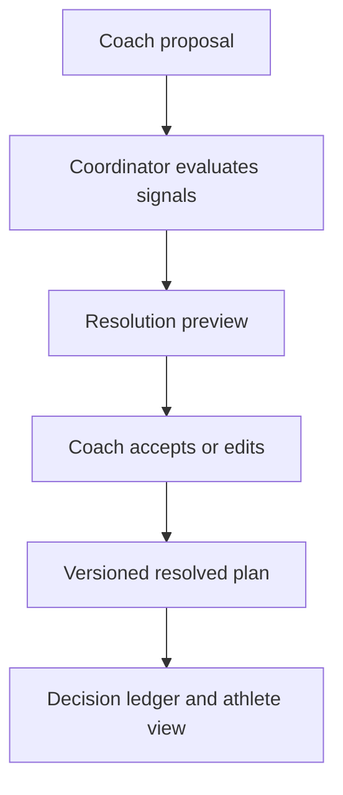

# Coaching Platform Market Research Bundle

**Research-only teardown — 6 August 2026**  
**Scope:** coach-side authoring and delivery for multi-week strength + conditioning.  
**Primary question:** what should a desktop-first coach’s bench borrow, reject, and make simpler than the current market?

This is research and product strategy, not an implementation plan or software prototype.

## High-Level Overview

### The market verdict

The category is not short on features. It is short on a reliable, reversible way to evolve a plan without making the coach or athlete wonder what changed, why it changed, or whether the original intent was lost.

The strongest opportunity is therefore not “one more workout builder.” It is an **evolution-safe coaching bench**:

1. A dense, calm planning surface for weeks and phases.
2. A fast session editor that works at both structured and free-form levels.
3. A typed prescription model that can be read as text and edited as fields.
4. A deterministic Coordinator that proposes changes rather than silently mutating the plan.
5. A reviewable, reversible resolution flow that preserves the coach’s anchors.
6. Durable data ownership, offline drafts, import/export, and a visible change ledger.

The market’s best precedents are distributed: Everfit and TeamBuildr for multi-week planning surfaces; TrainingPeaks and Intervals.icu for structured workout authoring; Liftosaur for compact progression notation; TrainerRoad for reviewable plan adaptation; Linear, Notion, Figma, and Superhuman for dense, high-speed interaction patterns.

### The design decision in one sentence

Build around **Proposal → Resolution Preview → Coach Decision → Versioned Plan**, with the grid and session editor acting as two views over the same typed plan model.

### Evidence tags

- **[observed]** Public documentation, current product pages, public help centres, app-store/community reports, or published research directly show the behaviour.
- **[inferred]** A reasoned conclusion from multiple observed precedents; useful for design, not a measured fact.
- **[speculation]** A hypothesis that needs authenticated trials, customer interviews, or product testing.

### Method and limits

The brief’s Tier 1 platforms were reviewed through public product/help material, public user complaints and switching discussions, current pricing/positioning pages, and research on autoregulation/readiness. Exact authenticated flows were not stopwatch-tested. Builder-time figures below are directional estimates, marked **[inferred]**, not performance claims.

## Deep Dive Analysis

## A. Object-model comparison

### A1. How the Tier 1 platforms think about a plan

| Platform | Publicly visible root model | Typical hierarchy | Reusable/progression primitive | Copy and comparison behaviour | Product read |
|---|---|---|---|---|---|
| [TrueCoach](https://help.truecoach.co/en/articles/3047401-programs) | Program | Program → calendar day → workout → warm-up/exercise/circuit/superset/cooldown | Workout/program templates; quick copy/paste | Multi-select copy/paste and drag/drop; no public first-class phase/progression grid | **[observed]** Fast, approachable workout authoring; weak explicit long-horizon model. |
| [Everfit](https://help.everfit.io/en/articles/10448762-introducing-program-master-planner) | Program + Master Planner | Program → week/date → day → workout → section → exercise → set/custom field | Full-week duplication, Shift-paste, template/library reuse, alternate exercises | Week-by-Week, Day-by-Day, Custom Master Planner; supports several planning horizons | **[observed]** The clearest coach-facing multi-week planning surface in the public set. |
| [CoachRx/OPEX](https://intercom.help/coachrx/en/articles/4837244-planning-periodization) | Long-term plan | Long-term plan → short-term cycle → daily plan → workout → sections/items | Cycles, plans, templates, RxBot generation | Day/Week/Month/Long-term calendar; copy/paste; Standard vs Live modes | **[observed]** Makes periodization explicit, though the hierarchy may feel heavy for a solo coach. |
| [TrainHeroic](https://support.trainheroic.com/hc/en-us/articles/18156951622669-For-Coaches-Copying-a-Program) | Program in a Library | Library → fixed-length Program → day/session → exercise or circuit block → set/rep/load/text | Whole-week copy/repeat; program templates; percentage of working max | Program-level copy and programming shortcuts; no same-weekday comparison documented | **[observed]** Strong reusable-program mental model; less explicit about why a future block changes. |
| [TeamBuildr](https://www.teambuildr.com/build) | Build/schedule | Build → date-based or free-form schedule → workout → sections → exercises/circuits/properties | Progression View; percentage and recurring structures | “All Mondays/Day 1s” side-by-side progression view; keyboard shortcuts | **[observed]** Best precedent for comparing the same training day across weeks. |
| [TrainingPeaks](https://help.trainingpeaks.com/hc/en-us/articles/21397126893581-Using-the-Strength-Workout-Builder) | Calendar and training plan | Training Plan → calendar day → workout → strength block → exercise/superset/circuit → parameters | Date-range bulk copy, templates, structured workout blocks | Calendar-centric; C+drag/keyboard shortcuts; strong endurance interoperability | **[observed]** Mature structured authoring, but strength semantics often spill into notes. |
| [Intervals.icu](https://intervals.icu/features/training-plan-editor/) | Plan/calendar | Plan → week/day → planned workout/note → structured or text steps | Copy whole weeks; text workout specification; annual phases | Drag/drop, weekly totals, multi-athlete plans; independent/linked workflows | **[observed]** Efficient text-first endurance planning; less complete for strength object semantics. |
| [TrainerRoad](https://support.trainerroad.com/hc/en-us/articles/360037923191-Plan-Builder-Overview) | Generated training plan | Plan Builder → Base/Build/Specialty → weekly schedule → workout | Algorithmic plan generation and adaptation | Adaptations Pending, future plan changes, alternates; not a blank coach-authored exercise builder | **[observed]** Strongest public precedent for presenting algorithmic plan changes as a reviewable event, with important reversibility weaknesses. |

### A2. Recommended canonical object model

The market repeatedly converges on a workout/session as the reusable unit, but the brief needs a richer long-horizon model. The recommended object graph is:

```text
Program
  → Phase / Cycle
    → Block
      → Week
        → Day
          → Session
            → Section
              → Item / Exercise
                → Prescription
```

Add three explicit layers that are usually implicit or fragmented:

| Layer | Purpose | Why it matters |
|---|---|---|
| Template | Reusable source object | Makes reuse intentional instead of relying on hidden copy semantics. |
| Assignment | Athlete-specific instance | Separates coach intent from what one athlete actually receives. |
| Resolution event | Immutable proposal, decision, and resulting version | Makes Coordinator behaviour auditable and reversible. |

**[inferred]** The key design distinction is not “program versus workout.” It is **intent versus instance versus resolved state**. A coach can author a phase template, assign it, and then inspect a specific athlete’s resolved plan without corrupting the reusable source.

### A3. Copy semantics to make explicit

The platforms use materially different meanings for “copy,” “repeat,” “sync,” and “template.” The new system should expose these as separate actions:

| Action | Meaning | Default recommendation |
|---|---|---|
| Duplicate | Make an independent copy now | Use for a one-off variation. |
| Repeat | Place independent copies across a range | Use for a fixed repeated block. |
| Link | Keep instances connected to a source until detached | Use only when the coach opts into propagation. |
| Apply template | Instantiate a named reusable source | Use for coach-owned patterns. |
| Copy-on-write | Start linked, fork automatically on first edit | Recommended default for safety and speed. |
| Sync | Propagate an explicit source change to selected instances | Always show affected instances and a preview. |

**[observed]** TrueCoach, CoachRx, Everfit, and TrainHeroic expose different combinations of sync, hard-copy, live-sync, and program-level duplication. **[inferred]** Ambiguous copy semantics are a major source of accidental source mutation and lost intent.

## B. Pattern catalogue — 56 patterns worth borrowing

The table is deliberately pattern-level. It identifies a reusable interaction or product behaviour, a precedent, and the constraint needed to keep it simple in a coaching context.

| # | Pattern | Precedent | What to borrow | Guardrail for the new bench |
|---:|---|---|---|---|
| 1 | Dense multi-week grid | [Everfit Master Planner](https://help.everfit.io/en/articles/10448762-introducing-program-master-planner) | See weeks, days, empties, and plan density in one surface | Keep cells compact; open detail in a peek/drawer. |
| 2 | Week-by-Week mode | [Everfit](https://help.everfit.io/en/articles/10448762-introducing-program-master-planner) | Horizontally compare weeks with stable weekday columns | Preserve weekday alignment; do not make every week a separate page. |
| 3 | Day-by-Day mode | [Everfit](https://help.everfit.io/en/articles/10448762-introducing-program-master-planner) | Inspect one day across several weeks | Make the comparison useful for progression decisions, not just navigation. |
| 4 | Same-weekday comparison | [TeamBuildr Build](https://www.teambuildr.com/build) | Show all Mondays/Day 1s side-by-side | Include deltas in dose, load, rest, and readiness constraints. |
| 5 | Variable planning horizon | [Everfit Master Planner](https://help.everfit.io/en/articles/10448762-introducing-program-master-planner) | Switch 1-, 2-, or 4-week density | Keep the same underlying model; only change the projection. |
| 6 | Hide empty days | [Everfit](https://help.everfit.io/en/articles/10448762-introducing-program-master-planner) | Reduce visual noise in dense plans | Make hidden days discoverable and preserve rest-day meaning. |
| 7 | Session peek/drawer | [Linear Peek](https://linear.app/docs/peek) | Inspect/edit without losing grid context | The drawer must support the common edit path, not become a second app. |
| 8 | Keyboard quick-open | [Linear](https://linear.app/docs/peek) | Space/shortcut opens the selected object | Provide visible shortcut hints and accessible alternatives. |
| 9 | Range selection | [Linear Select Issues](https://linear.app/docs/select-issues) | Select days/weeks as a unit | Selection must work by keyboard and pointer. |
| 10 | Contextual bulk bar | [Linear](https://linear.app/docs/select-issues) | Put duplicate/move/delete/repeat near the selection | Do not hide high-impact actions in an overflow menu. |
| 11 | Separate move/copy/duplicate/repeat | [TrueCoach multi-select](https://help.truecoach.co/en/articles/3053660-selecting-multiple-workouts-to-copy-paste-or-drag-drop) | Give each action a precise meaning | Never label all four “Copy.” |
| 12 | Full-week duplication | [Everfit copy/paste](https://help.everfit.io/en/articles/3060115-copy-and-paste-workouts) | Copy a complete week quickly | Show which days are included and whether rest days are preserved. |
| 13 | Repeat N weeks | [TrainHeroic shortcuts](https://support.trainheroic.com/hc/en-us/articles/18156803899661-Programming-Shortcuts-Copy-Paste-Delete-and-Repeat-Sessions) | Repeat a selected session/week across a range | Preview collisions before applying. |
| 14 | Selected-day paste | [Everfit](https://help.everfit.io/en/articles/3060115-copy-and-paste-workouts) | Paste only chosen days from a copied week | Preserve weekday intent and surface skipped days. |
| 15 | Date-range bulk copy | [TrainingPeaks Strength Builder](https://help.trainingpeaks.com/hc/en-us/articles/21397126893581-Using-the-Strength-Workout-Builder) | Apply a workout or plan across dates | Preview shifted dates and dependencies. |
| 16 | Copy-on-write templates | [Notion templates](https://www.notion.com/help/database-templates) | Reuse structure without silent source mutation | Label linked, forked, and independent states. |
| 17 | Library → program → session | [TrainHeroic](https://support.trainheroic.com/hc/en-us/articles/18156951622669-For-Coaches-Copying-a-Program) | Separate reusable content from scheduled delivery | Keep the path short for the solo coach. |
| 18 | Explicit phase/cycle objects | [CoachRx periodization](https://intercom.help/coachrx/en/articles/4837244-planning-periodization) | Name long-term and short-term intent | Allow a lightweight mode that does not require every layer. |
| 19 | Structured sections | [Everfit sections](https://help.everfit.io/en/articles/4620511-add-a-workout-section) | Warm-up, strength, conditioning, cooldown as visible blocks | Sections should be reorderable without flattening semantics. |
| 20 | Superset/circuit grouping | [Everfit supersets](https://support.everfit.io/en/articles/4620517-how-to-create-a-superset) | Preserve grouping as a first-class relation | Do not represent it only with indentation or text. |
| 21 | Custom fields | [Everfit workout builder](https://help.everfit.io/en/articles/4620472-create-a-workout) | Add coach-specific prescription fields | Custom fields need types, units, validation, and export semantics. |
| 22 | Structured fields plus notes | [TrainingPeaks strength notes](https://help.trainingpeaks.com/hc/en-us/articles/27889930846861-How-Do-I-Program-Rest-Periods-RPE-Rep-Ranges-Tempo-RIR-in-Strength-Workouts) | Keep nuance without making every concept a schema field | Notes never replace core dose/load/safety fields. |
| 23 | Alternate exercise slots | [TrainerRoad Workout Alternates](https://support.trainerroad.com/hc/en-us/articles/4402284012571-How-to-use-Workout-Alternates) | Plan substitutions without losing intent | Alternates inherit intent but may have different constraints. |
| 24 | Search-first exercise entry | [Everfit exercise builder](https://help.everfit.io/en/articles/4620472-create-a-workout) | Autocomplete library content quickly | Custom creation should be one keystroke away. |
| 25 | Blank-from-scratch entry | [TrueCoach builder](https://help.truecoach.co/en/articles/3047972-the-workout-builder-basics) | Let expert coaches type instead of wizard through | Default to the shortest valid input. |
| 26 | Text/structured synchronized views | [Intervals workout specification](https://forum.intervals.icu/t/syntax-of-workout-specification/109320) | Read a plan as compact text and inspect a visual parse | One source of truth; text is a projection, not a second parser. |
| 27 | Typed units | [Intervals plan editor](https://intervals.icu/features/training-plan-editor/) | Distinguish time, distance, reps, load, percent, RPE | Reject ambiguous units instead of silently guessing. |
| 28 | Progression presets | [TrainHeroic linear progression](https://support.trainheroic.com/hc/en-us/articles/18156690075917-Programming-with-Linear-Weight-Progression-or-Percentages) | Start with linear, percentage, rep-range, and training-max patterns | Show the rule in plain language before applying it. |
| 29 | Working-max reference | [TrainHeroic](https://support.trainheroic.com/hc/en-us/articles/18156690075917-Programming-with-Linear-Weight-Progression-or-Percentages) | Make the load anchor explicit | Store the reference value and its effective date. |
| 30 | RPE/RIR targets | [TrainingPeaks strength notes](https://help.trainingpeaks.com/hc/en-us/articles/27889930846861-How-Do-I-Program-Rest-Periods-RPE-Rep-Ranges-Tempo-RIR-in-Strength-Workouts) | Represent effort targets alongside load | Do not imply RPE is a validated objective truth. |
| 31 | Top-set/backoff pattern | [JuggernautAI](https://www.juggernautai.app/) and [Liftosaur](https://www.liftosaur.com/doc/liftoscript) | Separate anchor set from derived backoff work | Show which sets are derived and why. |
| 32 | Check-in before adaptation | [JuggernautAI](https://www.juggernautai.app/) | Ask a compact readiness question at a useful moment | Never turn the check-in into a daily survey tax. |
| 33 | Readiness state with explicit limits | [Athletica traffic-light readiness](https://athletica.ai/) | Use simple states to frame caution | State is an input, not the decision. |
| 34 | Pending proposal state | [TrainerRoad adaptations](https://support.trainerroad.com/hc/en-us/articles/4404676155035-Training-Adjustments-and-Notes) | Make future changes reviewable before they take effect | Never silently apply a material change. |
| 35 | Before/after semantic diff | [TrainerRoad adaptation overview](https://www.trainerroad.com/forum/t/skip-accept-adaptations/104064) | Show what changed in coach language | Compare sets, load, rest, intent, and schedule—not raw object IDs. |
| 36 | Grouped causal reasons | [TrainerRoad Fatigue Detection](https://support.trainerroad.com/hc/en-us/articles/20753792083995-What-is-TrainerRoad-s-Fatigue-Detection) | Explain a chain as one causal story | Keep “signal,” “inference,” and “action” visibly distinct. |
| 37 | Selective apply | [TrainerRoad forum feedback](https://www.trainerroad.com/forum/t/is-there-an-explanation-why-a-training-plan-is-changed/78782) | Accept some proposed changes and keep others | Give a stable default plus per-change overrides. |
| 38 | Undo/history | [Notion page history](https://www.notion.com/help/restore-deleted-pages) | Restore prior intent after an automation or bulk action | Every resolution gets a version, author, and timestamp. |
| 39 | Coach anchor preservation | [TrainerRoad training adjustments](https://support.trainerroad.com/hc/en-us/articles/4404676155035-Training-Adjustments-and-Notes) | Keep fixed sessions, constraints, and competition dates | Let the system say “cannot safely resolve” rather than override. |
| 40 | Freeze point | [Fitbod workout start behaviour](https://fitbod.me/) as a cautionary precedent | Define when a workout becomes execution state | State the freeze point and any allowed safe edits. |
| 41 | Proportional safety states | [WHOOP Recovery](https://www.whoop.com/thelocker/how-does-whoop-recovery-work-101/) | Use green/yellow/red only when action differs | Do not give the same warning treatment to a soft recommendation and a hard stop. |
| 42 | Missing-data state | [WHOOP](https://www.whoop.com/thelocker/how-does-whoop-recovery-work-101/) and [Athletica](https://athletica.ai/) | Show when a signal is absent or stale | “No readiness data” is better than a false green. |
| 43 | Visible saving/sync state | [Figma offline](https://help.figma.com/hc/en-us/articles/360040328553-What-can-I-do-offline-in-Figma) | Make local, syncing, saved, and failed states visible | A saved draft must not be confused with a resolved plan. |
| 44 | Offline local draft | [Notion offline](https://www.notion.com/help/use-pages-offline) | Keep authoring possible during poor connectivity | Queue safely; Coordinator resolution waits for authoritative sync. |
| 45 | Conflict review | [Figma](https://help.figma.com/hc/en-us/articles/360040328553-What-can-I-do-offline-in-Figma) | Surface competing edits instead of overwriting | Explain which version is local, remote, or resolved. |
| 46 | Import/migration assistant | [CoachRx migration](https://www.coachrx.app/articles/effortless-client-onboarding-and-importing) | Treat migration as a first-class product path | Preview mapping, preserve source history, and report losses. |
| 47 | Export as ownership | [TrainingPeaks export/help](https://www.trainingpeaks.com/) | Give the coach an understandable archive | Export both rendered plan and machine-readable source. |
| 48 | Decision ledger | [Linear activity patterns](https://linear.app/docs/peek) as an interaction precedent | Keep the reason and actor attached to changes | Ledger entries should be filterable by athlete, plan, and date. |
| 49 | Direct evidence links | [TrainingPeaks help](https://help.trainingpeaks.com/) | Link a field to the governing rule or source | Avoid citation clutter in the primary editing view. |
| 50 | “Not enough data” resolution | [TrainerRoad/Fatigue Detection](https://support.trainerroad.com/hc/en-us/articles/20753792083995-What-is-TrainerRoad-s-Fatigue-Detection) | Refuse low-confidence automation clearly | Offer a safe manual choice, not a guessed change. |
| 51 | Feedback at the decision moment | [JOIN](https://www.join.cc/) and [JuggernautAI](https://www.juggernautai.app/) | Ask about readiness where it can affect the next action | Avoid a separate intake workflow for every session. |
| 52 | Responsive density controls | [Notion views](https://www.notion.com/help/views-filters-and-sorts) | Let the coach choose compact, comfortable, or detail view | Keep field order stable across density modes. |
| 53 | Empty-grid actions | [Airtable records](https://support.airtable.com/docs/adding-duplicating-and-deleting-airtable-records) | Empty days offer “add session,” “copy prior,” or “rest” | Never make an empty cell a dead end. |
| 54 | Fixed skeleton states | [Cron changelog](https://www.cron.com/changelog) as premium interaction precedent | Preserve layout while data loads | Use deterministic placeholders for the grid and drawer. |
| 55 | Modifier-key copy | [Figma copy/paste](https://help.figma.com/hc/en-us/articles/4409078832791-Copy-and-paste-objects) | Make expert duplication fast | Always provide a visible non-keyboard path. |
| 56 | Shortcut discoverability | [Superhuman shortcuts](https://help.superhuman.com/hc/en-us/articles/46005789591693-Speed-Up-With-Shortcuts) | Let speed compound for expert users | Shortcuts must be searchable and conflict-free. |

## C. Anti-pattern catalogue — 45 traps to avoid

| # | Anti-pattern | Evidence/risk | Corrective principle |
|---:|---|---|---|
| 1 | Silent plan mutation | [TrainerRoad adaptation discussions](https://www.trainerroad.com/forum/t/is-there-an-explanation-why-a-training-plan-is-changed/78782) show users asking what changed and why | Material changes begin as proposals. |
| 2 | All-or-nothing adaptation | [TrainerRoad forum](https://www.trainerroad.com/forum/t/skip-accept-adaptations/104064) documents the burden of bulk decisions | Permit per-change decisions inside a grouped review. |
| 3 | No before state | Users ask to see the workout before adaptation | Preserve the original proposal and show semantic diff. |
| 4 | No undo after acceptance | Athletica users report no way to revert a change | Every accepted resolution creates a restorable version. |
| 5 | “Change for the sake of change” | [TrainerRoad forum complaint](https://www.trainerroad.com/forum/t/my-six-month-review-and-opinion-of-tr-ai-okay-but-also-not/113957) | Require a materiality threshold and explain the benefit. |
| 6 | Reason shown after metrics | Raw data does not answer “what should I do?” | State the action and rationale in plain language first. |
| 7 | Single score overrules context | Readiness research is mixed; commercial scores are not equivalent to causal truth | Treat signals as inputs with freshness and confidence. |
| 8 | Stale data presented as current | Wearable and manual inputs have different ages | Show timestamps and stale/unknown states. |
| 9 | Contradictory adaptation screens | JuggernautAI community reports can include readiness and warm-up recommendations pulling in different directions | Use one decision ledger and one final resolution. |
| 10 | Hard safety and soft suggestion look identical | Yellow and red actions have different stakes | Use proportional severity, language, and controls. |
| 11 | No freeze point | Pre-start edits can be overwritten in other training apps | Declare when the session becomes execution state. |
| 12 | Coach intent is not an anchor | Automatic changes can erase a competition date, fixed lift, or non-negotiable session | Let coaches mark constraints as fixed, flexible, or advisory. |
| 13 | Black-box AI positioned as coach replacement | CoachRx review concern that AI creates doubt in the coach-client relationship | Make AI subordinate to coach policy and visible evidence. |
| 14 | Generated plan with no review path | TrainerRoad is strong here but still has complaints about bulk changes | Generation must produce a reviewable plan event. |
| 15 | Full editor stuffed into a grid cell | Dense surfaces become slow and visually noisy | Use cell summary plus side peek. |
| 16 | Ambiguous “duplicate” | Platforms differ on linked, hard-copy, sync, and repeat semantics | Name each operation by its data effect. |
| 17 | Move, copy, repeat merged into drag | Dragging hides whether source content is removed or cloned | Separate actions and show the resulting count. |
| 18 | Drag-only interaction | Pointer-only workflows punish keyboard-first planning | Support keyboard, menu, and pointer equivalently. |
| 19 | No bulk selection | Repeating a block becomes manual day-by-day work | Provide range selection and contextual bulk actions. |
| 20 | Free-text-only workout authoring | Text is fast but hard to validate, compare, or resolve | Parse into typed fields; keep text as a projection. |
| 21 | Structured fields relegated to notes | TrainingPeaks users often put rest, RPE, tempo, and RIR in notes | Make core prescription semantics first-class. |
| 22 | Notes are silently dropped during copy | Custom nuances are often lost in automation | Show a copy report for unsupported or excluded fields. |
| 23 | Destructive superset conversion | Flattening groups breaks execution intent | Preserve grouping as a relation with explicit conversion. |
| 24 | Hidden empty days | Rest and availability are part of a plan | Hide only visually; never hide meaning. |
| 25 | No same-weekday comparison | A coach cannot inspect progression at a glance | Include a Day 1/Day 2 comparison mode. |
| 26 | Density collapses at 8–12 weeks | Monthly calendars become unreadable for multi-week work | Offer horizon and density controls. |
| 27 | No reusable source object | Rebuilding common sessions creates avoidable work | Let coaches promote a session or block to a template. |
| 28 | Template edits mutate live athletes | Source changes can rewrite history or future intent | Use copy-on-write and explicit propagation. |
| 29 | Linked versus hard-copy state is hidden | Users cannot predict downstream effects | Show a badge and a plain-language explanation. |
| 30 | One giant Save button | Authors do not know whether work is local, synced, or resolved | Show field-level save and plan-level resolution status. |
| 31 | False offline support | A local draft can be mistaken for authoritative data | Distinguish “saved locally” from “synced” and “resolved.” |
| 32 | Lost draft after network failure | Reliability complaints recur across coaching platforms | Queue changes locally and provide recovery. |
| 33 | Documentation lags a rebuild | TeamBuildr and TrainingPeaks discussions show interface/doc drift | Treat help content and migration notes as part of the release. |
| 34 | No migration path | Coaches are trapped by history, libraries, and rosters | Import and export are launch requirements for trust. |
| 35 | History locked inside the vendor | Switching becomes operationally expensive | Export the plan, logs, notes, and decision ledger. |
| 36 | Import only the visible workout | A plan without progression rules loses meaning | Import both rendered content and typed rules where possible. |
| 37 | No source attribution | Users cannot tell whether a change came from coach, athlete, Coordinator, or integration | Attach actor, cause, and timestamp to every material event. |
| 38 | Hidden shortcuts | Experts cannot discover speed paths | Add a shortcut palette and inline hints. |
| 39 | No failed-resolution recovery | “Cannot safely resolve” becomes a dead end | Preserve proposal, explain conflict, offer safe alternatives. |
| 40 | Conflict resolution by last-write-wins | Offline or multi-device edits can erase intent | Show the competing versions and let the coach choose. |
| 41 | AI creates more review work than it removes | Adaptation chains can become overwhelming | Apply only material, high-confidence changes by default. |
| 42 | Same warning for missing and dangerous data | Uncertainty and risk are not the same | Use distinct missing-data, caution, and hard-stop states. |
| 43 | Feature-count premium | Adding messaging, nutrition, payments, and marketplaces expands surface area before the core is reliable | Earn complexity only when it improves the planning loop. |
| 44 | No client-facing explanation | A coach sees the change but the athlete sees a surprise | Provide an appropriate plain-language explanation, without exposing internal noise. |
| 45 | No audit boundary between draft and delivery | A draft edit can be mistaken for a live plan | Make delivery/version state explicit at the top level. |

**[inferred]** The anti-patterns cluster around three failures: accidental mutation, hidden uncertainty, and operational lock-in. Fixing those three produces more differentiation than adding another library of exercises.

### C1. Verbatim complaint excerpts

These are preserved as short excerpts for failure-mode discovery. They are not prevalence estimates or efficacy evidence.

| Source | Short excerpt | What it signals |
|---|---|---|
| [TrainerRoad forum](https://www.trainerroad.com/forum/t/skip-accept-adaptations/104064) | “chain reaction of adaptations makes it too overwhelming to pay attention to” | A review flow can become more work than the automation saves. |
| [TrainerRoad forum](https://www.trainerroad.com/forum/t/my-six-month-review-and-opinion-of-tr-ai-okay-but-also-not/113957) | “Feels like change for the sake of change” | Frequent low-materiality changes erode confidence. |
| [TrainerRoad forum](https://www.trainerroad.com/forum/t/is-there-an-explanation-why-a-training-plan-is-changed/78782) | “Is it possible to see what the workout was before adaption…?” | Users need a before/after mental model, not only a new recommendation. |
| [CoachRx App Store reviews](https://apps.apple.com/us/app/coachrx-by-opex-fitness/id1544150077?platform=iphone&see-all=reviews) | “creates doubt in the coach-client relationship” | AI positioning can threaten the coach’s role if the boundary is unclear. |
| [TrueCoach Trustpilot](https://www.trustpilot.com/review/truecoach.co) | “unbelievably poor” | Reliability complaints can dominate the perceived value of a feature-rich product. |


## D. Notation, prescription, and progression

### D1. Comparative notation matrix

| System | Human-facing representation | Learnability | Speed after learning | Strengths | Failure mode |
|---|---|---:|---:|---|---|
| [Liftosaur / Liftoscript](https://www.liftosaur.com/doc/liftoscript) | `Bench Press / 3x8`, ranges, `@` effort, named progression functions | Medium-low initially | High | Compact rules, reusable progression, explicit scope | Syntax errors, mobile friction, and custom logic can be hard for new users. |
| [TrainingPeaks](https://help.trainingpeaks.com/hc/en-us/articles/235164967-Structured-Workout-Builder) | Guided structured blocks, targets, calendar, notes | Medium-high | Medium | Strong structured builder and interoperability | Strength nuance often lives in notes rather than validated fields. |
| [Intervals.icu](https://forum.intervals.icu/t/syntax-of-workout-specification/109320) | Readable interval text parsed into a visual workout | Medium | High for endurance | Fast text entry and visual parse | Informal/partial grammar, endurance bias, unit and nesting edge cases. |
| [Zwift ZWO](https://zwiftinsider.com/zwift-workout-file-creation/) | XML serialization | Low | Low manually | Machine-readable interchange | Poor authoring UX; semantics are easy to misread or break. |
| Common coaching notation | `3×8 @ 72.5 kg`, `RPE 8`, `%TM`, `2:00 rest`, `AMRAP` | High | High | Familiar, compact, teachable | Ambiguous units and unspoken progression rules. |

### D2. Recommendation: one typed model, two synchronized views

Use a **typed prescription object** as the source of truth. Render it as either:

- **Structured mode:** fields, selectors, validation, grouping, and rule controls.
- **Compact mode:** editable text projection for expert speed.

The text view should compile into the same object model. It should not create a second source of truth with a separate set of semantics.

Suggested compact grammar:

```text
Bench Press — 3×8 @ 72.5 kg, 120 s rest
Top Set — 1×5 @ RPE 8 → Backoff — 3×8 @ 90% top set
Week 2: +2.5 kg if all sets ≥ RPE 8 and no safety cap
If readiness < 3: cap @ RPE 7; keep movement pattern; do not add volume
```

The first line is intentionally familiar. The last two lines make the rule and the safety bound explicit. The authoring UI should expose the same rule as fields so a less technical coach never needs to learn a programming language.

### D3. Required typed fields

| Field group | Minimum semantics |
|---|---|
| Intent | Movement/pattern, training goal, optional coach note |
| Dose | Sets, reps, duration, distance, or interval count |
| Load | Absolute load, `%1RM`, `%TM`, `%FTP`, `%HRmax`, `%LTHR`, velocity, or none |
| Effort | RPE, RIR, talk-test, zone, or qualitative target |
| Rest | Duration, between-set/between-round scope |
| Tempo | Time or phase-specific tempo, if used |
| Progression | Trigger, action, bounds, reference value, effective date |
| Safety | Cap, stop rule, substitution rule, protected anchor |
| Resolution | Input signal, inference, action, confidence, reason, actor, version |

### D4. Progression primitives to ship first

| Primitive | Coach-facing language | Why it is useful |
|---|---|---|
| Linear load | “Add 2.5 kg each successful exposure” | Familiar and easy to audit. |
| Double progression | “Stay in 8–12; add load after 12s are achieved” | Common strength pattern with clear bounds. |
| Rep-sum | “Add reps until the weekly total reaches 40” | Handles flexible set distributions. |
| Training-max wave | “Use 70/75/80% of the current training max” | Makes the anchor explicit. |
| Top set/backoff | “Top set at target effort; derive backoffs from it” | Separates observed performance from planned load. |
| RPE/RIR bound | “Target RPE 8; stop at RPE 9” | Preserves intent while allowing autoregulation. |
| Readiness adjustment | “Reduce volume or cap intensity under a named threshold” | Safer than an opaque global rewrite. |
| Substitution | “Keep pattern and intent; use approved alternate” | Maintains continuity under equipment/pain constraints. |
| Deload | “Reduce dose by a bounded percentage or preserve intensity with less volume” | Makes deload intent inspectable. |

**Evidence note:** autoregulation is a legitimate coaching/methodology precedent, but the evidence does not establish that one commercial algorithm is universally superior. A 2022 meta-analysis found no significant 1RM difference between autoregulated and standardized resistance-training prescriptions in the included studies ([PubMed](https://pubmed.ncbi.nlm.nih.gov/35038063/)). A 2023 review found mixed evidence for readiness markers ([systematic review](https://sjsp.aearedo.es/index.php/sjsp/article/view/athlete-readiness-physical-physiological-perceptual-markers)). **[inferred]** The product should therefore make rules inspectable and bounded, not market “AI” as proven efficacy.

## E. Trust-UX playbook for the Coordinator

### E1. The recommended resolution sequence



The Coordinator is the final authority on safety and consistency, but the UX must make that authority legible. The coach remains the author of intent; the system is the resolver of constraints.

### E2. Rules

| # | Rule | Product behaviour |
|---:|---|---|
| 1 | Proposal before mutation | Material changes appear as pending proposals. |
| 2 | Immutable original | Preserve the coach-authored plan behind the preview. |
| 3 | Semantic diff | Say “sets reduced from 5 to 3” rather than showing internal IDs. |
| 4 | Reason before metrics | Lead with “protect recovery after two missed sessions”; expose metrics on demand. |
| 5 | Separate signal → inference → action | Show what was observed, what the system concluded, and what it recommends. |
| 6 | Data freshness | Show whether readiness is current, yesterday’s, stale, or missing. |
| 7 | Preserve anchors | Fixed dates, protected lifts, minimum dose, and coach notes survive unless explicitly unsafe. |
| 8 | Materiality threshold | Ignore or quietly log trivial changes; require review for material dose/load/schedule changes. |
| 9 | Group causal changes | Present a causal chain as one review unit, with per-change detail. |
| 10 | Per-change agency | Accept, keep original, edit constraint, or reject where safe. |
| 11 | Edit constraints, not magic values | The coach can change “cap volume at 3 sets,” not only overwrite a generated number. |
| 12 | Explicit freeze point | Explain which edits are still allowed before and after the session starts. |
| 13 | Version and undo | Any accepted proposal is a named, restorable version. |
| 14 | Proportional safety | Use different UI treatments for advisory, caution, and hard-stop states. |
| 15 | Missing data is visible | Never transform absence into a green signal. |
| 16 | Downstream consequence | Tell the coach how today’s decision affects the next session or block. |
| 17 | Consistent surfaces | Calendar, drawer, athlete view, and audit ledger should use the same status and reason. |
| 18 | Feedback at useful moments | Ask for readiness or outcome feedback when it can affect a decision, not as a separate survey routine. |
| 19 | No irreversible default | If the system cannot restore the original, it should not auto-apply the change. |
| 20 | “Cannot safely resolve” is valid | Preserve the conflict and route it to coach review instead of guessing. |

### E3. Precedent and counterpoint

TrainerRoad’s public adaptation flow is the strongest precedent for a pending review state: users can see an adaptation overview and accept/decline changes. Its forum also captures the weakness to avoid: users describe change chains as overwhelming and ask to see the pre-adaptation workout ([adaptation discussion](https://www.trainerroad.com/forum/t/skip-accept-adaptations/104064), [before/after request](https://www.trainerroad.com/forum/t/is-there-an-explanation-why-a-training-plan-is-changed/78782)).

JuggernautAI is a useful local-loop precedent: it adjusts within a session and across a block based on feedback. Its weaker public auditability is instructive. WHOOP is a useful advisory precedent: it reduces complex signals to a recovery state and a target, but users have also asked for a clearer “what to do” loop. **[inferred]** Progressive disclosure is essential: show the decision in one line, then let the coach open the causal evidence.

## F. Click-path benchmark — Tier 1

These are public-documentation paths and directional builder-time estimates, not authenticated stopwatch measurements.

| Platform | Approximate coach path | Reusable speed primitive | **[inferred]** blank 4-week build | Main friction to test live |
|---|---|---|---:|---|
| TrueCoach | Programs → create/select program → open day → workout builder → add sections/exercises → copy/paste | Multi-select copy/paste | 20–35 min | Long-horizon phase/progression visibility. |
| Everfit | Programs → create → Master Planner → Week-by-Week/Day-by-Day → open day → add workout → duplicate/Shift-paste | Full-week duplicate and planner modes | 10–20 min with library; 20–35 blank | Link/sync semantics and dense 8–12-week readability. |
| CoachRx | Program design calendar → long-term/short-term/daily plan → open day → add sections/items → copy or RxBot | Cycle hierarchy and generated starting point | 5–10 min with RxBot/template; 20–40 manual | Whether hierarchy helps or slows the solo coach. |
| TrainHeroic | Library → create program → select day/session → add Exercise/Circuit Block → define prescription → copy/repeat week | Program-level repeat and shortcuts | 12–25 min reusable; 20–35 blank | Explainable progression and source/link behaviour. |
| TeamBuildr | Build → schedule → add workout/sections/exercises → open Progression View | Same weekday/Day 1 comparison | 10–20 min | How much can be done without remembering hidden shortcuts. |
| TrainingPeaks | Calendar → create training plan → open day → strength builder → add exercise/superset/circuit → copy range | Date-range bulk copy and structured builder | 15–30 min | Strength semantics spread across fields and notes. |
| Intervals.icu | Plan/calendar → add planned workout → type or structure workout → copy week | Text specification and plan copy | 10–20 min reusable; 20–35 manual | Strength object model, grammar edge cases, and copy links. |
| TrainerRoad | Plan Builder → Base/Build/Specialty → generate calendar → inspect workout → review adaptations/alternates | Generated starting plan and adaptation review | 5–15 min generated | Not comparable to blank coach-authored strength programming. |

### F1. Benchmark target for the new bench

**[speculation]** A solo coach using a saved library should be able to:

- lay out a credible four-week phase in under 10 minutes;
- duplicate/repeat a week in under 15 seconds;
- inspect all Day 1 sessions across 8–12 weeks in one action;
- edit a session without losing grid context;
- understand any Coordinator proposal in under 30 seconds before opening detail;
- recover the previous plan in one explicit undo/history action.

These are hypotheses for usability testing, not claims about current performance.

## G. Table stakes versus differentiators

| Table stakes | Differentiators | Explicitly not the first wedge |
|---|---|---|
| Exercise library and custom exercises | Deterministic, reviewable resolution | Marketplace |
| Calendar/grid scheduling | Same-weekday progression comparison | Billing/payments |
| Sections, supersets, circuits | Typed text ↔ structured authoring | Messaging suite |
| Copy/paste and repeat | Copy-on-write with visible propagation | Nutrition tracking |
| Templates and assignments | Coach anchors and safe refusal | Social/community feed |
| Load, reps, rest, tempo, RPE/RIR | Versioned diff, undo, and decision ledger | Feature-count parity |
| Athlete feedback | Missing-data and confidence states | Generic AI content generation |
| Export and basic import | Continuity across offline, sync, and migration | Marketplace discovery |
| Mobile athlete delivery | Coach-first desktop speed | A consumer plan generator |

**[inferred]** The market makes table stakes look like differentiation because the category bundles many operational features. The opportunity is to make the core loop dramatically more trustworthy and faster.

## H. Simplicity principles — 14 rules

1. **One object, many views.** Grid, drawer, text, and athlete delivery render the same typed plan.
2. **Local context beats navigation.** Open a session without abandoning the week.
3. **One action per data effect.** Duplicate, repeat, link, sync, and move must never be synonyms.
4. **Progressive disclosure.** Show decision and consequence first; evidence on demand.
5. **Fast path for experts, safe path for everyone.** Keyboard/text entry sits beside structured controls.
6. **Every automation has a boundary.** State what it may change and what it cannot.
7. **Every material change has a before.** Never make the user trust memory.
8. **Templates fork safely.** Reuse should not create accidental live coupling.
9. **Empty space is data.** Rest, availability, and no-session days are intentional states.
10. **Unknown is a first-class state.** Missing readiness is not a positive readiness signal.
11. **The coach can protect intent.** Fixed anchors survive routine automation.
12. **Failures are recoverable.** Network, sync, conflict, and resolution failures preserve work.
13. **History is part of the product.** A plan is a time series of decisions, not only its latest state.
14. **Earn complexity.** Add fields when they change a decision, not because competitors have them.

## I. Graveyard and pivot lessons

| Case | What happened | Evidence | Lesson | Confidence |
|---|---|---|---|---|
| Today’s Plan | Specialized-owned training app announced closure in 2024; users were directed toward exports/refunds. | [Cycling Weekly report](https://www.cyclingweekly.com/news/specialized-owned-training-app-todays-plan-to-shut-down-in-2024) | Export and continuity cannot be an afterthought. A coach’s archive is a product promise. | **[observed]** Closure; **[inferred]** lesson. |
| Wahoo RGT | Virtual cycling product closed in 2023 as Wahoo focused on SYSTM. | [DC Rainmaker](https://www.dcrainmaker.com/2023/10/fitness-virtual-cycling.html), [forum discussion](https://www.trainerroad.com/forum/t/wahoo-rgt-closing-october-31st-2023/87217) | Product portfolio decisions can strand specialised history and habits; portability reduces customer risk. | **[observed]** |
| The Sufferfest → SYSTM | Product transition created history/badge continuity issues for some users. | [Wahoo announcement](https://wahoox.forum.wahoofitness.com/t/announcing-systm-the-new-home-of-the-sufferfest/11220), [support issue](https://support.wahoofitness.com/hc/en-us/articles/4407834426002-Some-of-my-badges-have-gone-missing-Why) | “New brand” work must preserve the old user’s identity, history, and earned meaning. | **[observed]** |
| indieVelo → TrainingPeaks Virtual | TrainingPeaks acquired indieVelo and launched TrainingPeaks Virtual; this is a pivot/acquisition, not a death. | [Outdoor Industry Association](https://outdoorindustry.org/press-release/trainingpeaks-acquires-indievelo-launches-trainingpeaks-virtual/) | Treat acquired data and workflows as migration design, not just a new logo. | **[observed]** |
| Fitocracy (low-confidence note) | Public community discussion indicates the legacy service became unavailable; authoritative closure details are weak. | [Community discussion](https://www.reddit.com/r/fitness30plus/comments/1er9uo4/moving_on_from_one_fitness_app_fitocracy_to/) | Do not build a graveyard narrative on low-quality evidence; mark uncertainty and preserve exports anyway. | **[low confidence]** |

The blunt market lesson is **continuity before novelty**: stable data, recoverable drafts, import/export, and explainable evolution are strategic—not administrative—features.

## J. Visual reference index

These are selected pages to inspect visually or use as design references. They are references, not recommendations to copy a UI wholesale.

| Reference | Inspect for | Link |
|---|---|---|
| Everfit Master Planner | Week-by-Week, Day-by-Day, Custom Planner, density | [Help article](https://help.everfit.io/en/articles/10448762-introducing-program-master-planner) |
| CoachRx Program Design Calendar | Long-term/short-term/daily plan hierarchy | [Help article](https://intercom.help/coachrx/en/articles/5829040-program-design-calendar) |
| TeamBuildr Build | Same-weekday/Progression View and build surface | [Build](https://www.teambuildr.com/build) |
| TrainingPeaks Strength Builder | Structured exercise/superset/circuit authoring | [Help article](https://help.trainingpeaks.com/hc/en-us/articles/21397126893581-Using-the-Strength-Workout-Builder) |
| TrainingPeaks keyboard shortcuts | Calendar speed and copy gestures | [Help article](https://help.trainingpeaks.com/hc/en-us/articles/38847458144013-Keyboard-Shortcuts) |
| Intervals.icu Plan Editor | Text/structured endurance planning and weekly totals | [Feature page](https://intervals.icu/features/training-plan-editor/) |
| TrueCoach Workout Builder | Straightforward blank workout construction | [Help article](https://help.truecoach.co/en/articles/3047972-the-workout-builder-basics) |
| TrainHeroic programming shortcuts | Repeat, copy, delete, keyboard operations | [Help article](https://support.trainheroic.com/hc/en-us/articles/18156803899661-Programming-Shortcuts-Copy-Paste-Delete-and-Repeat-Sessions) |
| TrainerRoad adaptation review | Pending changes and accept/decline language | [Forum example](https://www.trainerroad.com/forum/t/skip-accept-adaptations/104064) |
| TrainerRoad fatigue detection | Severity and safety framing | [Support article](https://support.trainerroad.com/hc/en-us/articles/20753792083995-What-is-TrainerRoad-s-Fatigue-Detection) |
| Liftosaur Liftoscript | Compact notation, named progression, supersets | [Documentation](https://www.liftosaur.com/doc/liftoscript) |
| Linear Peek | Side peek, context preservation | [Documentation](https://linear.app/docs/peek) |
| Linear Select Issues | Range selection and contextual actions | [Documentation](https://linear.app/docs/select-issues) |
| Notion database properties | Flexible typed objects and views | [Documentation](https://www.notion.com/help/database-properties) |
| Notion offline | Explicit continuity expectations | [Documentation](https://www.notion.com/help/use-pages-offline) |
| Figma copy/paste properties | High-speed property reuse | [Documentation](https://help.figma.com/hc/en-us/articles/4412765442967-Copy-and-paste-properties-between-layers) |
| Figma auto layout | Constraints and predictable reflow | [Documentation](https://help.figma.com/hc/en-us/articles/360040451373-Guide-to-auto-layout) |
| Airtable shortcuts | Dense data surface operations | [Documentation](https://support.airtable.com/docs/airtable-keyboard-shortcuts) |
| Superhuman shortcuts | Shortcut discoverability and speed culture | [Documentation](https://help.superhuman.com/hc/en-us/articles/46005789591693-Speed-Up-With-Shortcuts) |

## K. Ranked recommendations — top 15

| Rank | Recommendation | Evidence basis | Why it earns the rank |
|---:|---|---|---|
| 1 | Make Proposal → Resolution Preview → Decision → Version the core loop | TrainerRoad; trust complaints; deterministic Coordinator brief | This is the clearest whitespace and the highest-trust foundation. |
| 2 | Use one typed plan model rendered as grid, drawer, text, and athlete views | Everfit/TeamBuildr/TrainingPeaks/Intervals/Liftosaur | Prevents drift between fast authoring and auditable semantics. |
| 3 | Ship a dense week grid with a side peek editor | Everfit + Linear | Combines planning context and session detail without page churn. |
| 4 | Make same-weekday comparison a first-class mode | TeamBuildr | Directly supports progression review, the coach’s core weekly job. |
| 5 | Separate duplicate, repeat, link, sync, and apply-template | Cross-platform copy semantics | Eliminates the category’s most dangerous ambiguity. |
| 6 | Default to copy-on-write templates | Notion/Figma concepts + migration complaints | Gives reuse speed without accidental live coupling. |
| 7 | Add expert compact notation as a projection, not a DSL-first product | Liftosaur/Intervals.icu | Makes expert input fast without imposing programming on new coaches. |
| 8 | Make progression rules named, bounded, and inspectable | Liftosaur, TrainHeroic, 5/3/1, RP, autoregulation literature | Coaches can understand “why this number” without reading code. |
| 9 | Preserve coach anchors and let the Coordinator refuse unsafe resolution | TrainerRoad/Athletica/Juggernaut trust gaps | “Cannot safely resolve” is safer than a confident overwrite. |
| 10 | Build a semantic diff with per-change decisions | Adaptation UX complaints | Reduces second-guessing and makes automation usable at scale. |
| 11 | Treat offline drafts, conflict review, import, and export as trust features | Graveyard/switching complaints; Notion/Figma | Protects the coach’s history and lowers vendor lock-in anxiety. |
| 12 | Make missing/stale data explicit and keep signals separate from actions | WHOOP/readiness evidence | Prevents false certainty from a single score or stale wearable value. |
| 13 | Add a decision ledger with actor, reason, source, and version | Cross-platform evolution problems | Turns the plan into an understandable history rather than a mystery. |
| 14 | Optimize for a solo coach’s saved-library fast path | Builder benchmarks and brief scope | Complexity should compound leverage, not increase setup ceremony. |
| 15 | Instrument real workflow benchmarks before adding surface area | Public click-path gaps | Authenticated trials will reveal where the apparent whitespace is real. |

## L. Gaps, confidence, and what still needs validation

### L1. Confidence by deliverable

| Deliverable | Confidence | Why |
|---|---|---|
| A — object-model comparison | High | Public docs consistently expose hierarchy and copy primitives. |
| B — pattern catalogue | Medium-high | Multiple product precedents; some behaviours need live verification. |
| C — anti-pattern catalogue | Medium-high | Repeated across docs and complaints, but complaint samples are self-selected. |
| D — notation/progression | High for syntax precedents; medium for efficacy | Product grammar is observable; training outcomes are not established by this scan. |
| E — trust UX | Medium-high for interaction principles; medium for algorithmic efficacy | Reviewability principles are clear; commercial algorithms lack head-to-head validation. |
| F — click-path benchmark | Medium-low | Public paths are clear; estimates were not authenticated stopwatch trials. |
| G/H — table stakes and simplicity | Medium-high | Synthesis from the market; should be tested against target coaches. |
| I — graveyard lessons | Medium for continuity lessons; low for business-cause claims | Closures and pivots are observable; causes are often undisclosed. |
| J — visual reference index | High as a reference list | Links are direct; visual details can change with product releases. |
| K — ranking | Medium | Strategic judgment, not user research or market sizing. |

### L2. Specific gaps

- **Authenticated click depth:** exact steps, hotkeys, load times, and plan-tier restrictions need live trials for every Tier 1 platform.
- **Builder timing:** estimates should be replaced with a standardized task: author a four-week mixed strength/conditioning phase, duplicate it, change one progression rule, and resolve one readiness conflict.
- **Pricing/entitlements:** public pricing is volatile and often separates coach, athlete, business, and marketplace products. Use current pages ([TrueCoach](https://truecoach.co/pricing/), [Everfit](https://everfit.io/pricing/), [CoachRx](https://www.coachrx.app/pricing), [TeamBuildr](https://www.teambuildr.com/pricing), [Intervals.icu](https://www.intervals.icu/pricing/), [TrainerRoad](https://www.trainerroad.com/pricing)) as a live appendix, not a durable product assumption.
- **Complaint representativeness:** app stores, Trustpilot, Reddit, and forums over-represent extreme experiences. They are useful for failure-mode discovery, not prevalence estimates.
- **Algorithm efficacy:** no evidence in this scan demonstrates that a proprietary commercial readiness/adaptation algorithm consistently improves outcomes versus a human coach or a standard plan. The evidence is mostly about methodology, measurement validity, or user perception.
- **Graveyard causality:** Today’s Plan and Wahoo RGT closure facts are public; their full financial/strategic causes are not. Do not overclaim.
- **Tier 2 depth:** Trainerize, My PT Hub, Bridge Athletic, Volt, Fitr, PushPress Train, Hevy Coach, Exercise.com, WeStrive, Juggernaut AI, Boostcamp, Liftosaur, Final Surge, Athletica.ai, and JOIN.cc were used as pattern references, not full equal-depth teardowns.
- **Athlete-side experience:** the brief prioritizes the coach bench. The athlete’s explanation, feedback, and consent surfaces require a separate pass.
- **Accessibility and internationalization:** keyboard/screen-reader behavior, unit systems, time zones, and localization were not audited.

### L3. Next research pass

Run five identical live tasks across the Tier 1 set, interview 5–8 solo coaches about real planning/recovery conflicts, and validate the Coordinator’s proposed rules against a small set of de-identified historic plans. The output should replace estimates with measured task time, error counts, and trust ratings.

## Commercial and positioning notes

The category’s commercial shapes are also fragmented: coach subscriptions with client caps ([TrueCoach](https://truecoach.co/pricing/)), coach/business plans ([Everfit](https://everfit.io/pricing/), [TeamBuildr](https://www.teambuildr.com/pricing)), consumer athlete subscriptions ([TrainerRoad](https://www.trainerroad.com/pricing)), and low-cost/freemium endurance infrastructure ([Intervals.icu](https://www.intervals.icu/pricing/)). **[observed]** This reinforces the brief’s decision to defer billing, marketplace, and messaging. **[inferred]** The first proof point should be coaching leverage and trust, not business-suite parity.

## Source notes

Primary product/help sources are preferred for behaviour. Community/app-store/forum sources are used for complaint mining and are labelled as such. Research sources are used to bound claims about readiness and autoregulation; they do not validate any single vendor’s algorithm.

Key research sources:

- [Autoregulated versus standardized resistance training meta-analysis](https://pubmed.ncbi.nlm.nih.gov/35038063/)
- [Readiness-marker systematic review](https://sjsp.aearedo.es/index.php/sjsp/article/view/athlete-readiness-physical-physiological-perceptual-markers)
- [WHOOP-derived HR versus ECG study](https://pmc.ncbi.nlm.nih.gov/articles/PMC8160717/)
- [2025 cyclist adaptation study](https://www.nature.com/articles/s41598-025-13540-z)
- [Frontiers autoregulation study](https://www.frontiersin.org/journals/physiology/articles/10.3389/fphys.2022.891385/full)
- [2024 resistance-training autoregulation paper](https://pmc.ncbi.nlm.nih.gov/articles/PMC11343444/)

**Bottom line:** the defensible wedge is not a larger feature list. It is the fastest, clearest, safest way for a coach to author intent, compare progression, resolve readiness constraints, and recover the plan when reality changes.
